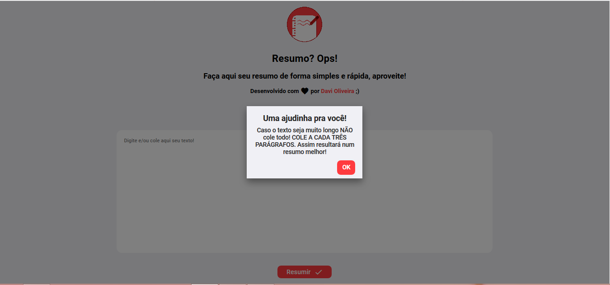
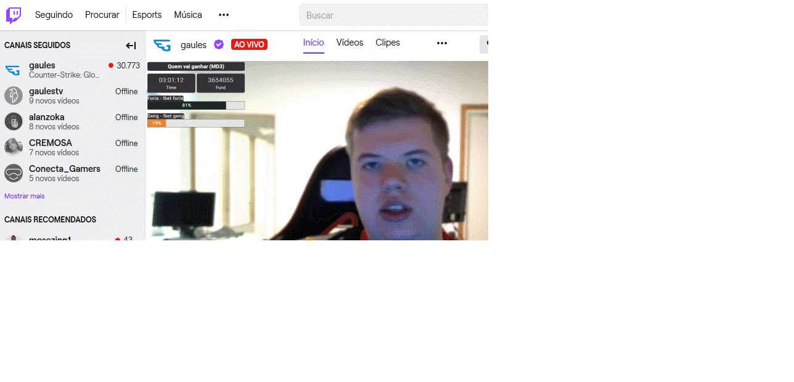

    <h1>Resumo? Ops!</h1>
    

---

## :notebook: Sobre o projeto:

Cansado de fazer resumos? Cansado de ter que ler aquele texto enorme daquele e-mail? Simples! Utilize nossa plataforma! A Inteligência Artificial irá resumir e pegar os pontos mais importantes do texto para você!

Foi utilizada a API do Algorithmia, de onde veio a I.A!

---

## :book: O que aprendi ?

1. Utilização da API do Algorithmia.
2. Implementação de DarkMode com CSS e JS puro.
3. Flex Layout.
4. Material UI
5. :muscle: e várias outras coisas!

---

## :hammer: Tecnologias utilizadas:

- JS
- HTML
- CSS
- JAVA (IA)

---

## :rocket: Como utilizar o projeto:

<b style="font-size:20px;">Pelo GitHub Pages:</b>

Acesse o link abaixo:

<a href="https://davioliveira-dev.github.io/resumo-ops/">`https://davioliveira-dev.github.io/resumo-ops/`</a>

<b style="font-size:20px;">Baixando a realease do projeto:</b>

No GitHub do projeto, clique na aba release e baixe o source code, e abra o arquivo <b>index.html</b>

<b style="font-size:20px;">Clonando o projeto:</b>

1. Com o git instalado, dê um git clone no projeto:
   `git clone https://github.com/davioliveira-dev/resumo-ops/`
2. Abra a pasta do projeto, e abra o arquivo <b>index.html</b>

---

## :beginner: Bônus! Exemplos:

<b style="font-size:22px;">Demonstrando a home da aplicação:</b>

<h3 align="center">
  
</h3>

<b style="font-size:22px;">Demonstrando a aplicação funcionando:</b>

<h3 align="center">
  
</h3>

<b style="font-size:22px;">Demonstrando a aplicação funcionando no mobile:</b>

<h3 align="center">
  
</h3>

<b style="font-size:22px;">Comparação do texto:</b>

<b> Texto original: </b>
Os vírus são seres diminutos, medindo cerca de 0,1µm de diâmetro, com dimensões apenas observáveis ao microscópio eletrônico. Basicamente são constituídos por ácido nucleico, que pode ser o DNA ou o RNA, envolvido por um invólucro proteico denominado capsídeo, que além de proteger o material genético, combina-se quimicamente com receptores membranares das células parasitadas.

Esses seres são acelulares, não possuindo orgânulos que desempenham a complexa síntese bioquímica. Somente exprimem atividades vitais: reprodução e propagação, no interior de uma célula hospedeira. Portanto, são considerados parasitas intracelulares obrigatórios.

<b> Texto resumido: </b>

Os vírus são seres diminutos, medindo cerca de 0,1µm de diâmetro, com dimensões apenas observáveis ao microscópio eletrônico. Basicamente são constituídos por ácido nucleico, que pode ser o DNA ou o RNA, envolvido por um invólucro proteico denominado capsídeo, que além de proteger o material genético, combina-se quimicamente com receptores membranares das células parasitadas. Somente exprimem atividades vitais: reprodução e propagação, no interior de uma célula hospedeira.

## :blue_book: Contribuindo

1. Dê um fork no projeto
   (<https://github.com/davioliveira-dev/resumo-ops/fork>)
2. Crie sua branch com o nome da feature que deseja criar
   (`git checkout -b feature/fooBar`)
3. Dê commit nas suas alterações
   (`git commit -am 'Add some fooBar'`)
4. Dê um <b>git push </b> para a branch
   (`git push origin feature/fooBar`)
5. Crie um novo Pull Request

---

## :blue_heart: Sobre mim ;)

 

 

